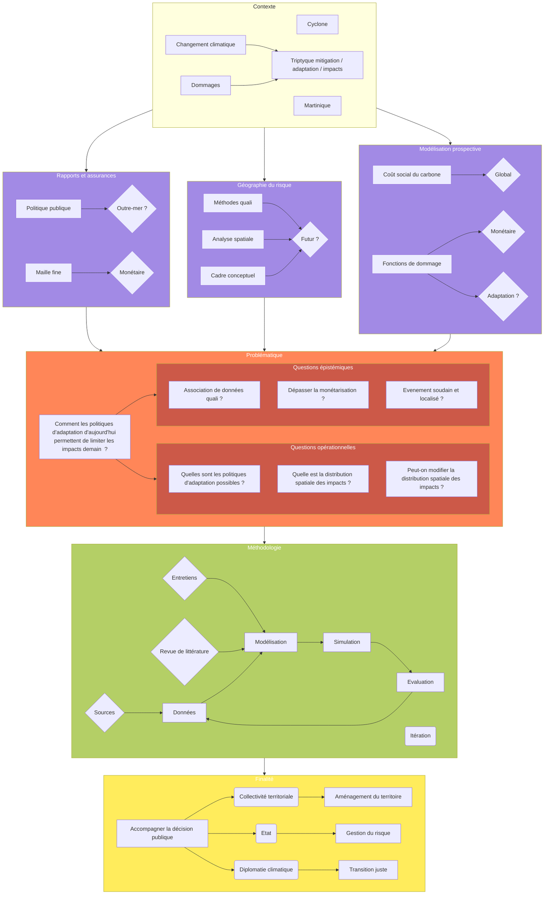

# Introduction

Projet de thèse. 

```mermaid
graph TD
    contexte --> risque
    contexte --> prospective
    contexte --> IAM
    
    A1 --> A4
    A2 --> A4
    A3 --> A4
    prospective --> question
    risque --> question
    IAM --> question
    
    subgraph contexte[Contexte]
    	C1[Cyclone]
        C2[Martinique]
        C3[Changement climatique] --> C5[Triptyque mitigation / adaptation / impacts]
        C4[Dommages] --> C5
        
    
    end
    
    subgraph risque["Géographie du risque"]
        A1[Méthodes quali]
        A2[Analyse spatiale]
        A3[Cadre conceptuel]
        A4{Futur  ?}
    end
    
    subgraph prospective["Rapports et assurances"]
    	P1[Politique publique] --> P3{Outre-mer ?}
        P2[Maille fine] --> P4{Monétaire}
    end
    
    subgraph IAM[Modélisation prospective]
    	I1[Coût social du carbone] --> I4{Global}
        I2[Fonctions de dommage] --> I5{Monétaire}
        I2 --> I6{Adaptation ?}
    end
    
    subgraph question[Problématique]
    
    	Q0[Comment les politiques d'adaptation d'aujourd'hui permettent de limiter les impacts demain  ?] --> ope
        Q0 --> epistemo
    
    	subgraph ope[Questions opérationnelles]
    	Q1[Quelles sont les politiques d'adaptation possibles ?]
        Q2[Quelle est la distribution spatiale des impacts ?]
        Q3[Peut-on modifier la distribution spatiale des impacts ?]
        end
        
        subgraph epistemo[Questions épistémiques]
        	Q4[Association de données quali ?]
            Q5[Dépasser la monétarisation ?]
            Q6[Evenement soudain et localisé ? ]
        
        end
    end
    
    question --> methodo
    
    subgraph methodo[Méthodologie]
    	M1[Données]
        M2[Modélisation]
        M3[Simulation]
        M4[Evaluation]
        M5(Itération)
        M6{Entretiens} --> M2
       
        M7{Revue de littérature} --> M2
        M8{Sources} --> M1
        
        	M1 --> M2 --> M3 --> M4--> M1
		
    
    end

    
    methodo  --> finalité
    
    
    subgraph finalité[Finalité]
    
    	Ac0[Accompagner la décision publique] --> Ac1
        Ac0 --> Ac2
        Ac0 --> Ac
    	Ac1(Collectivité territoriale) --> F1[Aménagement du territoire]
        Ac2(Etat) --> F2[Gestion du risque]
        Ac(Diplomatie climatique) --> F3[Transition juste]
    
    end
    
    
    
    
style IAM fill:#a28ae5, color:#fff;
style prospective fill:#a28ae5, color:#fff;
style risque fill:#a28ae5, color:#fff;

style question fill:#FF8658, color:#fff;
style ope fill:#CC5948, color:#fff;
style epistemo fill:#CC5948, color:#fff;


style methodo fill: #B4CF66, color:#fff;

style finalité fill: #FFEC5C, color:#fff;


```