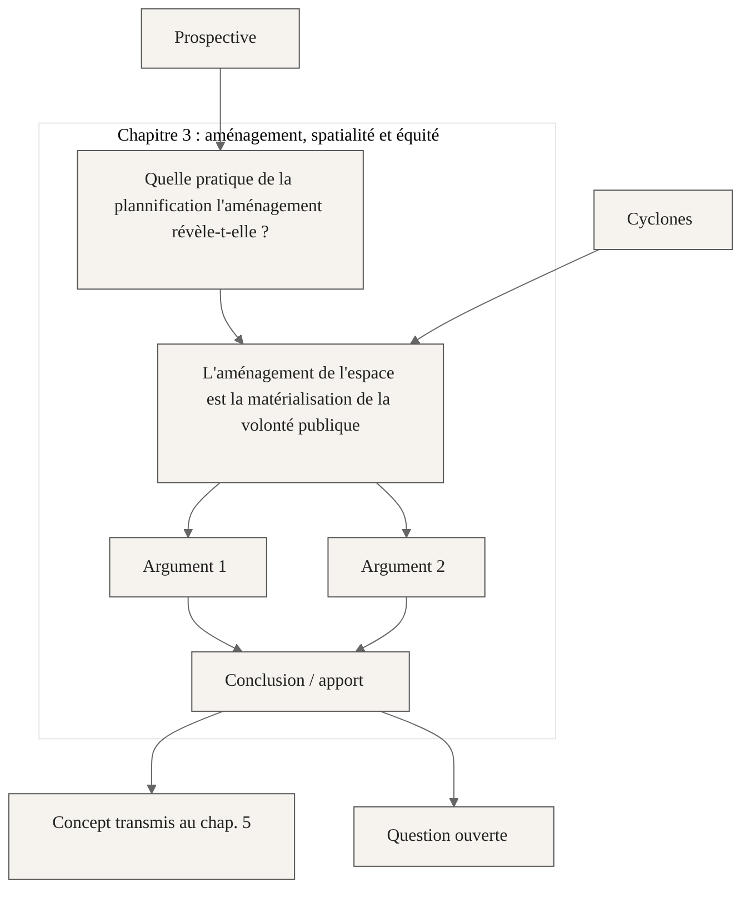

:::{tip} Idées en vrac

- l'aménagement est une forme d'action publique
- l'aménagement est l'incarnation matérielle de la volonté politiuqe
- l'aménagement est aussi l'incarnation des limites de la volonté politiques, de ses zones d'ombre, de ses échecs
- l'aménagement du territoire est une forme de plannification de la société
- les choix de zonage réglementaire représentent un choix de futur souhaité / souhaitable
- l'aménagement de l'espace se fait dans une complexité importante : les dimensions physiques et sociales se croisent en permanance
- un bon aménagement doit prendre en compte les effets directs qu'il induit, mais aussi les effets indirects
- aménager, même d'une manière parfaite, implique de faire des gagnants et des perdants
- un aménagement a une effet distributif fort : il faut non seulement chercher à obtenir le meilleur effet global, mais aussi s'interroger sur les effets distributif d'un aménagement
- aménager les territoires est une bonne stratégie pour s'adapter au changement climatique
- c'est une manière de se prémunir contre les risques, mais aussi de repenser la société au regard de ces nouvelles configurations
- c'est un outil qui permet de porter à l'échelle collective les raisonnements, et pas seulement au niveau individuel, contrairement à des contraintes réglementaires batimentaires par exemple

:::

:::{figure}
:name: fig-test
:align: center

Position du chapitre par rapport aux autres chapitres
:::