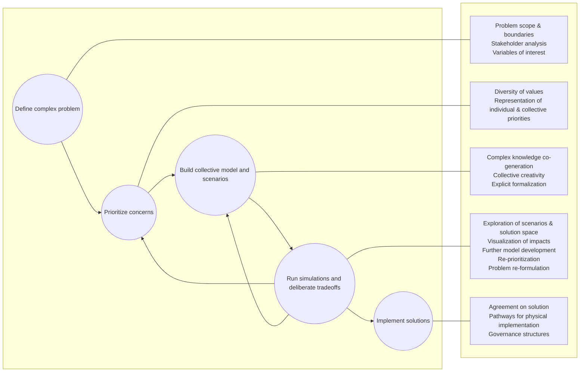

---
parts:
  kind: "Fiche notion"
  abstract: >
    La modélisation d'accompagnement est un approche qui a pour but de
  keypoints:
    - keypoint 1
exports:
  - format: pdf
    template: lapreprint-typst
    output: notion-commod.pdf
    id: notion-commod
downloads:
  - id: notion-commod
    title: "PDF"
---

# Modélisation d'accompagnement

## Définition

La modélisation d'accompagnement est une approche collaborative pour formaliser des représentations partagées d'un même phénomène. 

> PM is a collaborative approach to formalize shared representations of a problem using a wide range of qualitative and quantitative modeling techniques (e.g., rich pictures, mapping and geographic information systems, causal diagraming, agent-based and system dynamic modeling, integrated assessment modeling, etc.) (Voinov et al., 2018) --- @zellnerParticipatoryModelingCollaborative2024

En reformulant et en traduisant cette définition, on peut arriver à la définition suivante : 

Modélisation d'accomapagnement : démarche d'accompagnement qui utilise des techniques de modélisation pour partager des représentation d'un phénomène. 

### Une démarche ...

plus qu'un corpus ou des méthodes, c'est surtout une posture (d'où la notion de démarche / posture / approach / processus)

> « une posture, une attitude par rapport à la manière d’aborder une question et un terrain donnés, prenant en compte les différents types de savoirs et de perceptions en présence, ainsi que l’usage de certains outils. » ([Étienne, 2010, p. 21](zotero://select/library/items/PUEBVM7Y)) ([pdf](zotero://open-pdf/library/items/2VSD6G4X?page=23&annotation=6JFTJHMF))

### ... d'accompagnement ...

qui ?

collectivités, décideurs, citoyens

personnes impliquées dans un conflit / problématique

profanes == non expert, en tout cas hors de l'académique

### ... qui utilise des techniques de modélisation ...

qualitatives

quantitatives

hybrides

### ... pour partager des représentations ...

qu'est-ce qu'une représentation ?

en quoi est-ce qu'elles ne sont pas partagées ?

### ... d'un phénomène

quel phénomène ?

Exemples

qu'est-ce qu'un phénomène ?

## Historique

Un retour en force de la participation au tournant des années 80 

> « Ainsi, depuis les années 80, et désormais sous l’injonction des bailleurs de fonds internationaux, les approches participatives se généralisent (Pimbert et Pretty, 1997). Elles reposent sur plusieurs hypothèses. Sur le plan normatif, il est considéré qu’encourager l’apprentissage social et individuel est bon pour la société et les citoyens en général (Ludwig, 2001 ; Latour, 1999). La seconde hypothèse, d’ordre substantif, considère qu’encourager la prise en compte de la pluralité des points de vue améliore la compréhension des enjeux, l’identification et la sélection des solutions adaptées (Van den Hove, 2001). Enfin, sur le plan instrumental, encourager les collaborations faciliterait grandement l’implémentation des solutions et réduirait les conflits (Brandon et Wells, 1992). Ainsi, les approches participatives permettraient de dépasser la mise en opposition de l’intérêt général et des intérêts particuliers, et de reconnaître la place de la dimension procédurale et négociée de l’intérêt général (Trom, 1999). » ([Étienne, 2010, p. 109](zotero://select/library/items/PUEBVM7Y)) ([pdf](zotero://open-pdf/library/items/2VSD6G4X?page=111&annotation=RE6ZU5YR))

Il y a donc une double fonction de la participation. D'une part, acquérir plus d'information auprès des acteurs qui sont porteurs de ces informations, y compris si elles sortent du domaine de l'expertise. D'autre part, le processus de participation a un effet en soit sur les personnes qui y participent.

C'est dans cette dualité, et plus particulièrement la deuxième partie, que s'inscrit la modélisation d'accompagnement. Le modèle n'est plus seulement ou primairement un instrument permettant de produire des données, mais surtout un processus qui a un effet sur les personnes impliquées. (voir pour ça le développement sur le modèle en général)

Un changement de paradigme, avec plus de place pour les non-experts : transdisciplinarité

> « While science has traditionally emphasized objectivity, rationality and expert-driven data collection and analysis for problemsolving, PM emerges as one manifestation within a larger trend towards democratizing science for social learning and collective deliberation through iterative participatory processes (Hubacek et al., 2016; Zellner et al., 2012). » ([Zellner, 2024, p. 2](zotero://select/library/items/WCPDJJBY)) ([pdf](zotero://open-pdf/library/items/AHDYV65T?page=2&annotation=L3IMRXNY))

> « There is a growing realization, however, that diverse and non-modeling stakeholders are a critical component of this collaborative process. » ([Zellner, 2024, p. 2](zotero://select/library/items/WCPDJJBY)) ([pdf](zotero://open-pdf/library/items/AHDYV65T?page=2&annotation=342WN7GF))

On passe d'un système pensé par des experts, dans le champs académique, à la valorisation et la construction autour de personnes en dehors de ces circuits habituels

variété des approches à distinguer

participatory modelling

modélisation d'accompagnement

Aussi appelé Companion Modelling ou participatory modeling

## Caractéristiques

### un framework / workflow formalisé par le collectif COMMOD

#### Processus itératif autour de grandes étapes

> « Each step of the iterative process is designed to support specific goals and outcomes (bottom), towards the implementation of solutions to complex landscape and environmental problems. Facilitation and Assessment activities run across the entire process to support inclusion and representation, as well as adaptation of tools, participation and learning structures, and valuation with new insights. » ([Zellner, 2024, p. 3](zotero://select/library/items/WCPDJJBY)) ([pdf](zotero://open-pdf/library/items/AHDYV65T?page=3&annotation=VF6BUBFM))

:::{figure}
:label: my-figure
:align: left

Tentative de légende du schéma. Adapté d'après @zellnerParticipatoryModelingCollaborative2024.
:::

C'est intéressant parce qu'on voit clairement la finalité : implémenter des solutions; mais aussi les différentes niveaux de  : on veut construire des modèles collectifs, prioriser les problèmes, définir des problèmes complexes

#### le processus de modélisation se fait en plusieurs étapes.

Le premier point qui est intéressant c'est la finalité, qui est clairement définie: implémenter des solutions. A la différences d'autres modèles qui peuvent chercher seulement à représenter des phénomènes, les modèles issus de la modélisation d'accompagnement visent à avoir un effet transformateur sur le phénomène, notamment à travers la recherche de *solutions*.

Un deuxième point qui est important c'est celui de la décomposition en étape. La participation est valorisée à chaque étape, y compris pendant la conceptualisation du modèle (définition du problème, priorisation des concerns, construction du modèle et des scénarios, simulations).

Enfin, l'itération est centrale. Chaque phase éclaire les autres, et à travers des itérations successives de toutes les phases, on affine progressivement le modèle (au sens large, y compris la définition du problème ou des priorités).

#### un nouveau rôle pour les modélisateur.ices : celui de l'accompagnement

Etienne et Al. 2010 définissent trois rôles distincts dans la construction du modèle

le thématicien est le plus proche de la réalité

> « Le thématicien définit le modèle du domaine en utilisant la sémantique qu’il associe au système de référence. » ([“La modélisation d'accompagnement. Une démarche participative en appui au développement durable”, 2010, p. 73](zotero://select/library/items/PUEBVM7Y)) ([pdf](zotero://open-pdf/library/items/2VSD6G4X?page=75&annotation=K8LY8RPH))

le modélisateur formalise cette thématique et ces termes

> « le modélisateur adapte le modèle du domaine en un modèle plus formel dit modèle de conception (ou modèle conceptuel) qui a pour but de clarifier les concepts utilisés, » ([“La modélisation d'accompagnement. Une démarche participative en appui au développement durable”, 2010, p. 73](zotero://select/library/items/PUEBVM7Y)) ([pdf](zotero://open-pdf/library/items/2VSD6G4X?page=75&annotation=45R7PR5N))

l'informaticien produit le modèle de simulation

> « Finalement, le modèle conceptuel pourra être transcrit par l’informaticien en un modèle opérationnel ou modèle de simulation. » ([“La modélisation d'accompagnement. Une démarche participative en appui au développement durable”, 2010, p. 74](zotero://select/library/items/PUEBVM7Y)) ([pdf](zotero://open-pdf/library/items/2VSD6G4X?page=76&annotation=DGGIMJA6))

approcher la production scientifique de savoir non scientifiques

### La remise en question de savoirs descendants

> « Ces changements sont profonds car, d’une part, ils remettent en cause les approches descendantes classiques dans la formulation et la mise en œuvre des Projets et, d’autre part, ils reconnaissent la capacité des acteurs locaux à gérer euxmêmes leurs ressources et à orienter leur développement. » ([Étienne, 2010, p. 109](zotero://select/library/items/PUEBVM7Y)) ([pdf](zotero://open-pdf/library/items/2VSD6G4X?page=111&annotation=6KUCGHXB))

on n'a plus le modèle qui est produit d'une part, par les chercheurs, en dehors du monde, puis appliqué

Construire une compréhension / représentation partagée

> « 2.2. Prioritizing concerns: Making social complexity visible » ([Zellner, 2024, p. 3](zotero://select/library/items/WCPDJJBY)) ([pdf](zotero://open-pdf/library/items/AHDYV65T?page=3&annotation=P3JKB4PC))

La Modélisation participative permet de mettre sur la table des systèmes de valeur parfois distincts, pour les expliciter et les mettre en discussion. En cela, elle permet de dépasser des difficultés antérieures, comme la monétarisation.

Ce Point est particulièrement intéressant, parce qu'il pourrait permettre de mieux prendre en compte l' informalité et la normativité => projet de recherche

« L’objectif d’une opération d’accompagnement est 

soit la production de connaissances (à destination des chercheurs et des acteurs locaux) dans le cadre d’une meilleure compréhension d’un système d’interactions,

soit l’appui à une négociation dans le cadre d’un processus qui vise explicitement une transformation des pratiques d’interactions avec la ressource ou une transformation des formes d’interactions socioéconomiques. » ([“La modélisation d'accompagnement. Une démarche participative en appui au développement durable”, 2010, p. 12](zotero://select/library/items/PUEBVM7Y)) ([pdf](zotero://open-pdf/library/items/2VSD6G4X?page=14&annotation=53N548RA))

### une variété de techniques et de méthodes

Niveau d'autonomie

([pdf](zotero://open-pdf/library/items/2VSD6G4X?page=77&annotation=8KEIZGDX))  
([Étienne, 2010, p. 75](zotero://select/library/items/PUEBVM7Y))

quantitatifs et qualitatifs

des limites indépassables

attention aux jeux de pouvoir au sein des acteurs !!!

> « L’une des critiques les plus couramment adressées aux démarches participatives est le manque de prise en compte de la complexité de ces jeux d’acteurs au sein desquels elles sont mises en œuvre (Cooke et al., 2001 ; d’Aquino, 2007 ; Eversol, 2003 ; Lavigne Delville et al., 2000) (chapitre 4). » ([Étienne, 2010, p. 125](zotero://select/library/items/PUEBVM7Y)) ([pdf](zotero://open-pdf/library/items/2VSD6G4X?page=127&annotation=I35S92UI))

